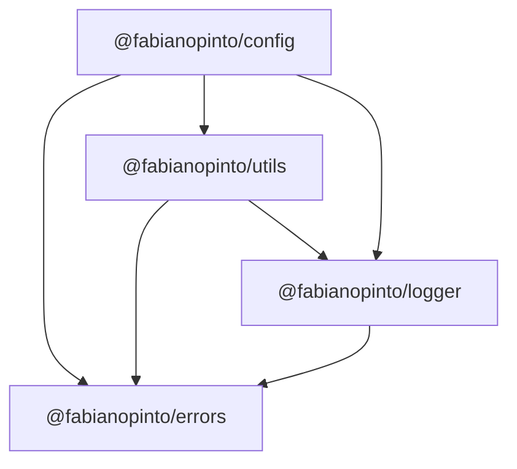

<p align="center">
  
</p>

# ts-common

[](https://github.com/fabianopinto/ts-common/actions/workflows/ci.yml)

A TypeScript monorepo of reusable packages:

- [@fabianopinto/errors](./packages/errors/README.md) — AppError with cause and context
- [@fabianopinto/config](./packages/config/README.md) — Composable, immutable configuration with SSM/S3 resolution
- [@fabianopinto/logger](./packages/logger/README.md) — Pino-based logger with clean interface
- [@fabianopinto/utils](./packages/utils/README.md) — string, date, and object helpers

## Architecture



## Tech stack

- Node 22+, pnpm workspace
- TypeScript strict mode; ESM-first build with CJS compatibility
- tsup per package (bundler mode) emitting ESM, CJS, and d.ts
- Changesets for per-package SemVer and changelogs
- GitHub Actions for CI (PRs) and Releases

## Getting started

```bash
pnpm install
pnpm build
```

## Packages

- `packages/errors`
- `packages/config`
- `packages/logger`
- `packages/utils`

## Development

- Build all: `pnpm build`
- Watch a package: `pnpm --filter <pkg> dev`
- Test all: `pnpm test`

### Example usage

```ts
import { Configuration } from "@fabianopinto/config";
import { logger } from "@fabianopinto/logger";

// Initialize configuration (from object or using ConfigurationFactory to load JSON files)
Configuration.initialize({
  service: { name: "users", port: 3000 },
  logging: { level: "info" },
});

// Retrieve values (external refs like ssm:// or s3:// are resolved when enabled)
const cfg = Configuration.getInstance();
const port = await cfg.getValue<number>("service.port");

// Use the shared logger
logger.setLevel((await cfg.getValue<string>("logging.level")) ?? "info");
logger.info("Service starting", { port });

// ... start your app
logger.info("Service started");
```

## Versioning & Releases (Changesets)

```bash
pnpm changeset         # create a changeset
pnpm changeset version # apply versions and changelogs
pnpm build             # build packages
pnpm changeset publish # publish changed packages to npm
```

## CI & Release automation

- CI: `.github/workflows/ci.yml` runs install, build, and tests on PRs/pushes
- Release: `.github/workflows/release.yml` versions + publishes changed packages via Changesets

## License

ISC © Fabiano Pinto
