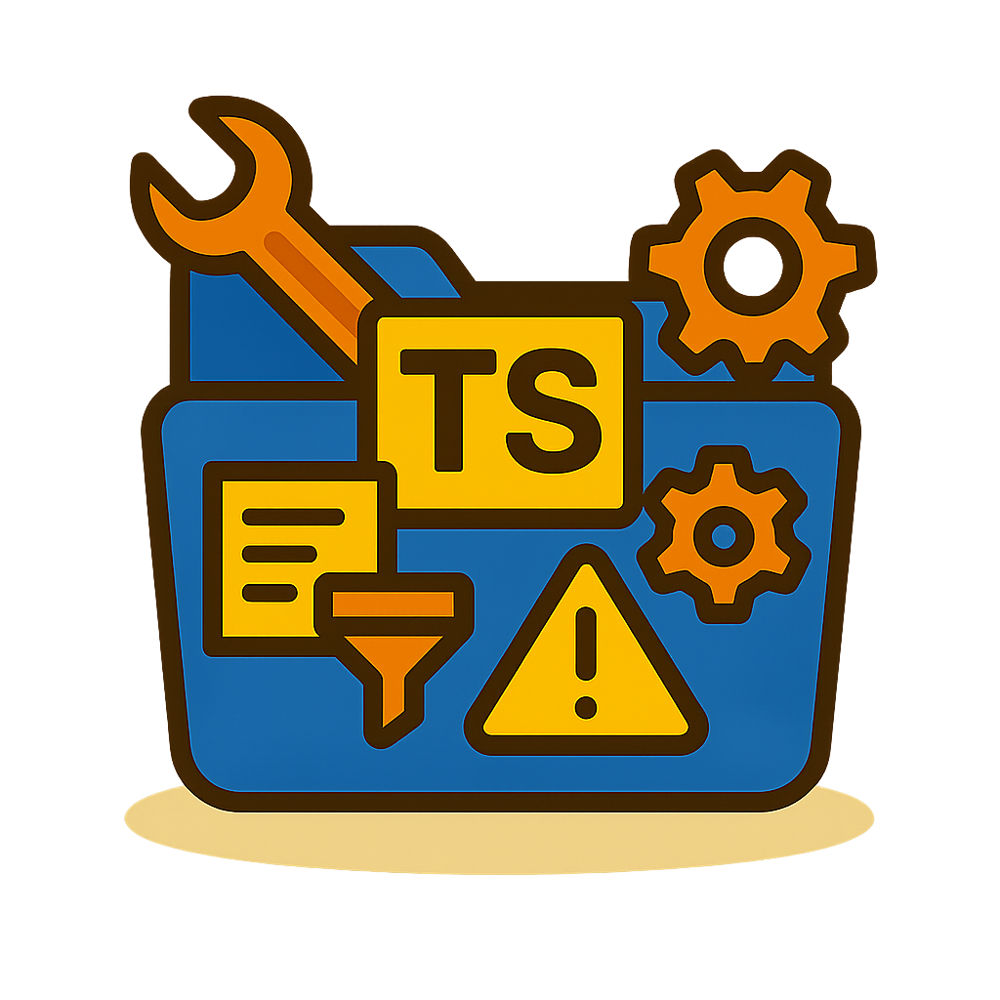
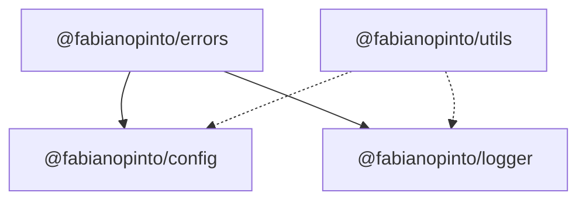

<p align="center">
  
</p>

# ts-common

[](https://github.com/fabianopinto/ts-common/actions/workflows/ci.yml)

A TypeScript monorepo of reusable packages:

- @fabianopinto/errors — AppError with cause and context
- @fabianopinto/config — dotenv + zod config loader
- @fabianopinto/logger — Pino-based logger with clean interface
- @fabianopinto/utils — string, date, and object helpers

## Architecture



## Tech stack

- Node 18+, pnpm workspace
- TypeScript strict mode; ESM-first build with CJS compatibility
- tsup per package (bundler mode) emitting ESM, CJS, and d.ts
- Changesets for per-package SemVer and changelogs
- GitHub Actions for CI (PRs) and Releases

## Getting started

```bash
pnpm -w install
pnpm -r build
```

## Packages

- `packages/errors`
- `packages/config`
- `packages/logger`
- `packages/utils`

## Development

- Build all: `pnpm -r build`
- Watch a package: `pnpm --filter <pkg> run dev`
- Test all: `pnpm -r test`

### Example usage

```ts
import { loadConfig } from "@fabianopinto/config";
import createLogger from "@fabianopinto/logger";

const cfg = loadConfig();
const logger = createLogger({ level: cfg.LOG_LEVEL });

logger.info("Service starting", { env: cfg.NODE_ENV, port: cfg.PORT });
// startServer(cfg.PORT)
logger.info("Service started");
```

## Versioning & Releases (Changesets)

```bash
pnpm changeset         # create a changeset
pnpm changeset version # apply versions and changelogs
pnpm -r build          # build packages
pnpm changeset publish # publish changed packages to npm
```

## CI & Release automation

- CI: `.github/workflows/ci.yml` runs install, build, and tests on PRs/pushes
- Release: `.github/workflows/release.yml` versions + publishes changed packages via Changesets

## License

ISC © Fabiano Pinto
