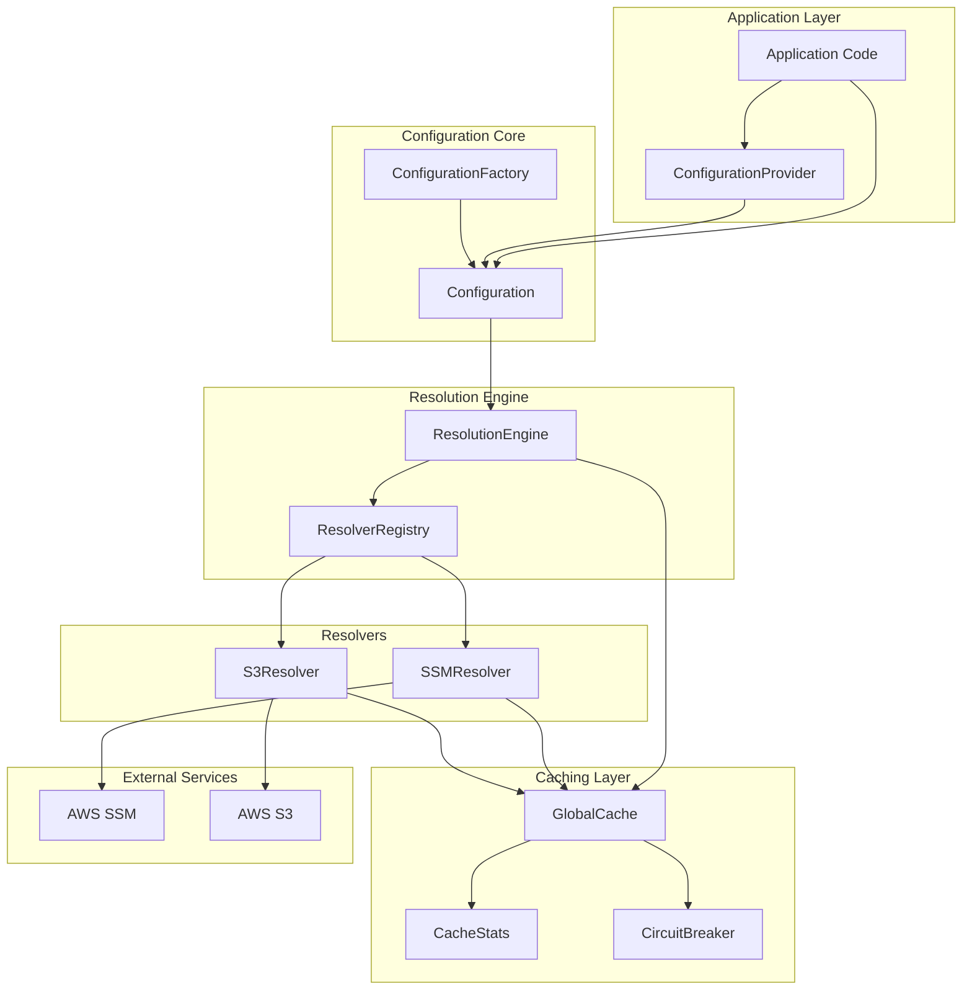
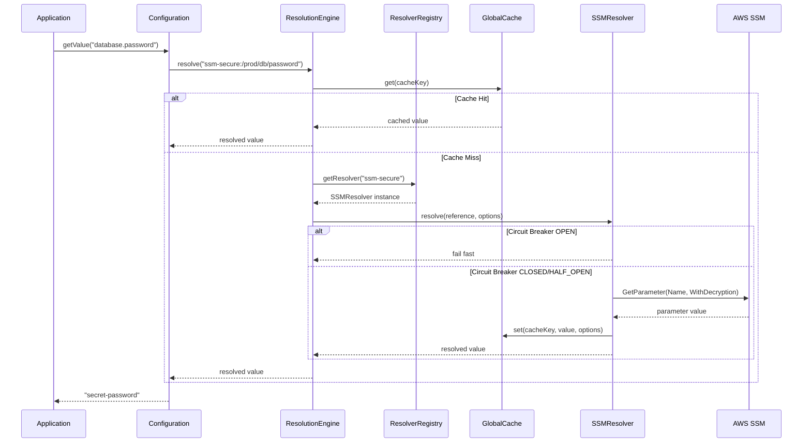

# Configuration System Architecture

> **📖 Main Documentation**: [README.md](./README.md) | **⚡ Performance Guide**: [PERFORMANCE.md](./PERFORMANCE.md)

## Overview

The `@t68/config` package provides a high-performance, production-ready configuration system with intelligent external reference resolution, advanced caching, and comprehensive monitoring capabilities.

## System Architecture

### Core Components



## Core Interfaces

### ConfigResolver Interface

The unified resolver interface supports both individual and batch operations:

```typescript
interface ConfigResolver<TOptions extends Record<string, unknown> = Record<string, unknown>> {
  // Core properties
  readonly protocol: string;
  readonly defaultOptions: TOptions;

  // Core methods
  initialize(logger: Logger): Promise<void> | void;
  validateReference(reference: string): boolean;
  resolve(reference: string, options: TOptions, logger: Logger): Promise<string>;
  cleanup?(): Promise<void> | void;

  // Optional batch capabilities
  readonly supportsBatch?: boolean;
  resolveBatch?(
    requests: BatchResolutionRequest<TOptions>[],
    logger: Logger,
  ): Promise<BatchResolutionResult[]>;
}
```

## Advanced Caching System

### GlobalCache Features

The `GlobalCache` provides enterprise-grade caching with comprehensive edge case handling:

```typescript
interface GlobalCacheConfig {
  maxEntries?: number;              // Maximum cache entries (default: 10000)
  maxSizeBytes?: number;            // Maximum memory usage (default: 100MB)
  defaultTtlMs?: number;            // Default TTL (default: 5 minutes)
  cleanupIntervalMs?: number;       // Cleanup frequency (default: 1 minute)
  enableLru?: boolean;              // LRU eviction (default: true)
  enableAutoCleanup?: boolean;      // Auto cleanup (default: true)
  memoryPressureThreshold?: number; // Memory pressure threshold (default: 0.8)
  maxEntrySizeBytes?: number;       // Max entry size (default: 10MB)
  enableCircuitBreaker?: boolean;   // Circuit breaker (default: true)
  enablePriorityEviction?: boolean; // Priority eviction (default: true)
  minCacheSize?: number;            // Minimum cache size (default: 100)
}
```

### Edge Case Handling

#### Out-of-Memory Protection

- **Memory pressure monitoring** with adaptive cleanup
- **Size limits** per entry and total cache
- **Intelligent eviction** based on priority and usage patterns

#### Cache Starvation Prevention

- **Priority-based eviction** (`LOW`, `NORMAL`, `HIGH`, `CRITICAL`)
- **Resolution cost consideration** for intelligent caching decisions
- **Minimum cache size** protection

#### Eviction Storm Prevention

- **Storm detection** monitoring eviction patterns
- **Temporary limit increases** during high pressure
- **Adaptive behavior** to prevent cascading failures

#### Circuit Breaker Pattern

- **Automatic failure detection** with configurable thresholds
- **State management** (`CLOSED`, `OPEN`, `HALF_OPEN`)
- **Self-healing** with automatic recovery

## Resolver Implementations

### SSMResolver (Unified)

The unified SSM resolver handles both `ssm:/` and `ssm-secure:/` protocols intelligently:

```typescript
export class SSMResolver implements ConfigResolver<SSMResolverOptions> {
  public readonly protocol = "ssm";
  public readonly supportsBatch = true;

  // Intelligent protocol handling
  private getEffectiveOptions(reference: string, options: SSMResolverOptions) {
    const isSecureProtocol = reference.startsWith("ssm-secure:/");
    return {
      withDecryption: options.withDecryption ?? isSecureProtocol,
      retries: options.retries ?? 3,
      cacheTtlMs: options.cacheTtlMs ?? 5 * 60 * 1000,
    };
  }
}
```

**Key Features:**

- **Protocol Intelligence**: Auto-detects decryption needs from protocol
- **Batch Optimization**: Up to 10 parameters per `GetParameters` API call
- **Advanced Caching**: Priority-based caching with circuit breaker
- **Error Handling**: Comprehensive retry logic and error recovery

### S3Resolver

Handles S3 object content and metadata retrieval:

```typescript
export class S3Resolver implements ConfigResolver<S3ResolverOptions> {
  public readonly protocol = "s3";
  public readonly supportsBatch = false; // Individual resolution only

  // Supports both content and metadata retrieval
  public async resolve(
    reference: string,
    options: S3ResolverOptions,
    logger: Logger,
  ): Promise<string>;
}
```

**Capabilities:**

- **Content retrieval** from S3 objects
- **Metadata extraction** with selective field support
- **Streaming support** for large objects
- **Error handling** with retry logic

## Performance Optimizations

### Batch Processing

The resolution engine automatically detects batch capabilities and optimizes API usage:

```typescript
// Multiple SSM parameters resolved efficiently
const config = {
  database: {
    host: "ssm:/prod/db/host",
    port: "ssm:/prod/db/port",
    user: "ssm:/prod/db/user",
    password: "ssm-secure:/prod/db/password",
  },
};

// Results in 2 API calls:
// 1. GetParameters for regular params (host, port, user)
// 2. GetParameters for secure param (password) with decryption
```

### Intelligent Caching Strategy

The caching system uses multiple strategies for optimal performance:

1. **Priority-Based Eviction**
   - `CRITICAL`: Never evicted except under extreme memory pressure
   - `HIGH`: Protected during normal operations (secure parameters)
   - `NORMAL`: Standard eviction rules (regular parameters)
   - `LOW`: First to be evicted

2. **Resolution Cost Tracking**
   - Expensive operations (batch API calls) get higher cache priority
   - Individual resolutions have lower priority
   - Failed resolutions are penalized in eviction scoring

3. **Memory Pressure Adaptation**
   - `LOW`: Normal operation
   - `MEDIUM`: Proactive cleanup of expired entries
   - `HIGH`: Aggressive cleanup (30% cache reduction)
   - `CRITICAL`: Emergency cleanup (50% cache reduction)

### Circuit Breaker Implementation

Automatic failure detection and recovery:

```typescript
enum CircuitBreakerState {
  CLOSED,    // Normal operation
  OPEN,      // Failing fast, cache disabled
  HALF_OPEN, // Testing recovery
}

// Configuration
{
  circuitBreakerThreshold: 5,          // Failures before opening
  circuitBreakerResetTimeoutMs: 60000, // 1 minute recovery timeout
}
```

## Extensibility

### Custom Resolver Implementation

The architecture supports custom resolvers for any protocol:

```typescript
export class CustomResolver implements ConfigResolver<CustomOptions> {
  public readonly protocol = "custom";
  public readonly defaultOptions: CustomOptions = {};
  public readonly supportsBatch = false; // Optional batch support

  public async initialize(logger: Logger): Promise<void> {
    // Initialize resources (connections, clients, etc.)
  }

  public validateReference(reference: string): boolean {
    return reference.startsWith("custom://");
  }

  public async resolve(reference: string, options: CustomOptions, logger: Logger): Promise<string> {
    // Custom resolution logic
    return "resolved-value";
  }

  public cleanup(): void {
    // Clean up resources
  }
}
```

### Batch-Capable Resolver

For high-performance scenarios, implement batch capabilities:

```typescript
export class BatchCustomResolver implements ConfigResolver<CustomOptions> {
  public readonly supportsBatch = true;

  public async resolveBatch(
    requests: BatchResolutionRequest<CustomOptions>[],
    logger: Logger,
  ): Promise<BatchResolutionResult[]> {
    // Batch resolution logic
    // Group requests, make bulk API calls, return results
  }
}
```

## Production Configuration

### Recommended Cache Settings

```typescript
// Production environment
const cache = GlobalCache.getInstance({
  maxSizeBytes: 512 * 1024 * 1024,     // 512MB
  maxEntries: 50000,                   // 50K entries
  maxEntrySizeBytes: 10 * 1024 * 1024, // 10MB per entry
  memoryPressureThreshold: 0.8,        // 80% threshold
  enableCircuitBreaker: true,
  circuitBreakerThreshold: 5,          // 5 failures
  circuitBreakerResetTimeoutMs: 60000, // 1 minute reset
  enablePriorityEviction: true,
  minCacheSize: 1000,                  // Never below 1K entries
  cleanupIntervalMs: 30000,            // 30 seconds
  defaultTtlMs: 10 * 60 * 1000,        // 10 minutes
});
```

### Monitoring and Alerting

Key metrics to monitor in production:

```typescript
const stats = cache.getStats();

// Performance metrics
const hitRatio = stats.hitRatio;                       // Target: >70%
const efficiencyScore = stats.efficiencyScore;         // Target: >0.6

// Health metrics
const memoryPressure = stats.memoryPressure;           // Monitor: HIGH/CRITICAL
const circuitBreakerState = stats.circuitBreakerState; // Monitor: OPEN

// Problem indicators
const evictionStorms = stats.evictionStorms;           // Alert: >0
const outOfMemoryEvents = stats.outOfMemoryEvents;     // Alert: >0
const starvationEvents = stats.starvationEvents;       // Alert: >0

// Resource usage
const memoryUsageMB = stats.totalSizeBytes / 1024 / 1024;
const totalEntries = stats.totalEntries;
```

### Alert Thresholds

- **Hit ratio < 70%**: Cache may be undersized or TTL too short
- **Efficiency score < 0.6**: Cache configuration needs optimization
- **Memory pressure = HIGH/CRITICAL**: Increase memory limits or reduce TTL
- **Eviction storms > 0**: Memory pressure or configuration issues
- **Circuit breaker = OPEN**: Cache system failures need investigation
- **Starvation events > 0**: Priority configuration needs adjustment

## Resolution Flow

### Complete Resolution Sequence



## Best Practices

### Configuration Organization

```typescript
// Organize configuration by environment and service
const config = {
  environment: "production",
  service: {
    name: "user-api",
    port: 3000,
    database: {
      host: "ssm:/prod/user-api/db/host",
      port: "ssm:/prod/user-api/db/port",
      username: "ssm:/prod/user-api/db/username",
      password: "ssm-secure:/prod/user-api/db/password",
    },
    external: {
      authService: "ssm:/prod/shared/auth-service-url",
      apiKeys: {
        stripe: "ssm-secure:/prod/user-api/stripe/api-key",
        sendgrid: "ssm-secure:/prod/user-api/sendgrid/api-key",
      },
    },
  },
  features: {
    enableNewUI: "ssm:/prod/user-api/features/new-ui",
    enableBetaFeatures: "ssm:/prod/user-api/features/beta",
  },
};
```

### Error Handling

```typescript
try {
  await Configuration.getInstance().preload();
} catch (error) {
  if (error instanceof ConfigurationError) {
    logger.error(
      {
        code: error.code,
        context: error.context,
      },
      "Configuration validation failed",
    );

    // Handle specific error types
    switch (error.code) {
      case "CONFIG_SSM_PARAMETER_NOT_FOUND":
        // Handle missing SSM parameter
        break;
      case "CONFIG_S3_OBJECT_NOT_FOUND":
        // Handle missing S3 object
        break;
      default:
      // Handle other configuration errors
    }
  }

  process.exit(1);
}
```

### Performance Optimization

```typescript
// Batch related parameters together
const dbConfig = {
  connection: {
    host: "ssm:/prod/db/host",
    port: "ssm:/prod/db/port",
    database: "ssm:/prod/db/name",
    username: "ssm:/prod/db/username",
    password: "ssm-secure:/prod/db/password",
  },
};

// Access all at once to trigger batch resolution
const connectionConfig = await config.getValue("dbConfig.connection");
```

This architecture provides a robust, high-performance configuration system that scales from simple applications to enterprise-grade deployments with comprehensive monitoring and error handling capabilities.
