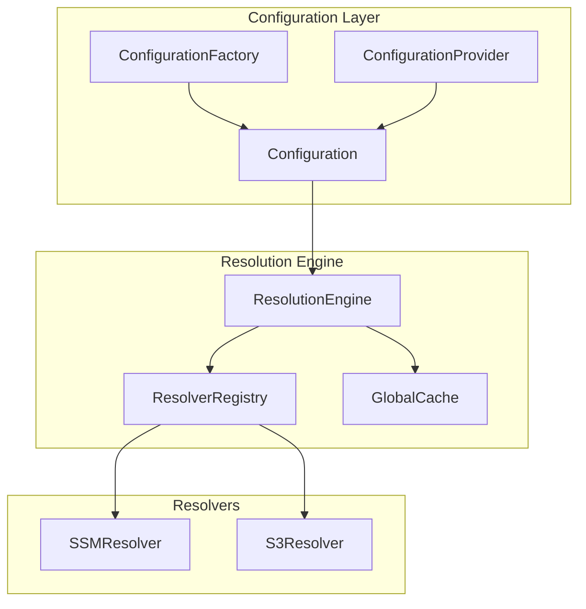
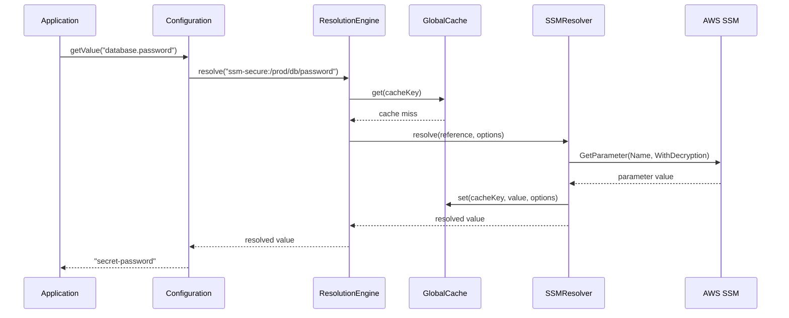

# @t68/config

High-performance, immutable configuration system for Node.js/TypeScript applications with intelligent external reference resolution, advanced caching, and pluggable resolver architecture.

## Key Features

- **🔒 Immutable Configuration**: Thread-safe global configuration with deep-freeze protection
- **🔗 Smart Resolution**: Automatic resolution of `ssm:/`, `ssm-secure:/`, and `s3://` references
- **⚡ High Performance**: Advanced caching with circuit breaker, memory pressure handling, and batch optimization
- **🧩 Pluggable Architecture**: Extensible resolver system for custom protocols
- **📊 Production Ready**: Comprehensive monitoring, statistics, and error handling
- **🎯 Type Safe**: Full TypeScript support with strict mode compatibility

This package is part of the ts-common monorepo (see the [root README](../../README.md)) and integrates with:

- [@t68/utils](../utils/README.md) for retry utilities and helpers
- [@t68/logger](../logger/README.md) for structured logging
- [@t68/errors](../errors/README.md) for structured error handling

## Documentation

- **[Architecture Guide](./ARCHITECTURE.md)** — Technical architecture, caching system, and production configuration
- **[Performance Guide](./PERFORMANCE.md)** — Performance benchmarks, monitoring, and optimization strategies

## Table of Contents

- [Installation](#installation)
- [Quick Start](#quick-start)
- [Core Concepts](#core-concepts)
- [External References](#external-references)
- [Advanced Usage](#advanced-usage)
- [Performance & Monitoring](#performance--monitoring)
- [API Reference](#api-reference)
- [Architecture](#architecture)
- [License](#license)

## Installation

```bash
# Core package with required peer dependencies
pnpm add @t68/config pino
# or
npm install @t68/config pino

# Optional AWS SDK clients (only if using SSM/S3 references)
pnpm add @aws-sdk/client-ssm @aws-sdk/client-s3
# or
npm install @aws-sdk/client-ssm @aws-sdk/client-s3

# Development dependencies
pnpm add -D pino-pretty
# or
npm install --save-dev pino-pretty
```

### Peer Dependencies

- **`@aws-sdk/client-ssm`** — Optional, required only for `ssm:/` and `ssm-secure:/` references
- **`@aws-sdk/client-s3`** — Optional, required only for `s3://` references
- **`pino`** — Required for structured logging
- **`pino-pretty`** — Optional, for pretty-printed logs in development

## Quick Start

```typescript
import { Configuration } from "@t68/config";

// Initialize with simple configuration
Configuration.initialize({
  service: {
    name: "my-service",
    port: 3000,
    database: {
      host: "localhost",
      password: "ssm-secure:/prod/db/password", // Resolved automatically
    },
  },
});

// Access configuration anywhere in your app
const config = Configuration.getInstance();
const port = await config.getValue<number>("service.port");
const dbPassword = await config.getValue<string>("service.database.password");
```

## Core Concepts

### Immutable Configuration

Configuration is deeply frozen and immutable after initialization, ensuring thread safety and preventing accidental modifications.

```typescript
const config = Configuration.getInstance();
// config.data is readonly and deeply frozen
```

### Dot-Notation Access

Access nested configuration values using dot notation paths:

```typescript
const config = {
  database: {
    connection: {
      host: "localhost",
      port: 5432,
    },
  },
};

const host = await cfg.getValue<string>("database.connection.host");
const port = await cfg.getValue<number>("database.connection.port");
```

### Configuration Factory

Build configuration from multiple sources with deep merging:

```typescript
import { ConfigurationFactory } from "@t68/config";

// Static methods for quick setup
// From files (later files override earlier ones)
const config = await ConfigurationFactory.buildFromFiles([
  "./config/base.json",
  "./config/production.json",
]);

// From objects
const config2 = ConfigurationFactory.buildFromObject({
  service: { name: "api" },
  features: { newUI: true },
});

// From S3 objects
const config3 = await ConfigurationFactory.buildFromS3([
  "s3://config-bucket/base.json",
  "s3://config-bucket/prod.json",
]);

// Builder pattern for complex scenarios
const factory = new ConfigurationFactory({
  resolve: { external: true },
  logger: customLogger,
});

// Add multiple sources in sequence
factory
  .addObject({
    environment: "production",
    service: { name: "api-server" },
  })
  .addObject({
    database: { host: "localhost", port: 5432 },
  });

// Add configuration files
await factory.addFile("./config/base.json");
await factory.addFile("./config/production.json");

// Add S3 configuration
await factory.addS3("s3://config-bucket/shared.json");

// Build the final configuration
const builtConfig = factory.build();
```

## External References

The configuration system automatically resolves external references using a high-performance resolver architecture.

### SSM Parameter Store

```typescript
// Regular parameters (no decryption by default)
const config = {
  database: {
    host: "ssm:/prod/db/host",
    port: "ssm:/prod/db/port",
  },
};

// Secure parameters (decryption enabled by default)
const secrets = {
  database: {
    password: "ssm-secure:/prod/db/password",
    apiKey: "ssm-secure:/prod/api/key",
  },
};

// Override protocol defaults
const customConfig = {
  // Force decryption for regular protocol
  secret: "ssm:/prod/secret", // with { withDecryption: true }

  // Disable decryption for secure protocol
  encrypted: "ssm-secure:/prod/encrypted", // with { withDecryption: false }
};
```

### S3 Objects

```typescript
const config = {
  templates: {
    welcome: "s3://templates-bucket/welcome.html",
    terms: "s3://legal-bucket/terms.txt",
  },

  // Get S3 object metadata instead of content
  metadata: "s3://bucket/file.json", // with { metadata: true }
};
```

### Performance Optimizations

The resolver system includes several performance optimizations:

- **Batch Processing**: Multiple SSM parameters resolved in single API calls (up to 10 per batch)
- **Intelligent Caching**: Advanced caching with TTL, priority-based eviction, and memory pressure handling
- **Circuit Breaker**: Automatic failure detection and recovery
- **Memory Management**: Adaptive cleanup and out-of-memory protection

For detailed benchmarks and optimization strategies, see the **[Performance Guide](./PERFORMANCE.md)**.

## Advanced Usage

### Custom Resolution Options

```typescript
// Disable external resolution globally
Configuration.initialize(data, {
  resolve: { external: false },
});

// Per-call resolution control
const rawValue = await config.getValue("path", { resolve: false });
const resolved = await config.getValue("path", { resolve: true });

// Protocol-specific options
const ssmValue = await config.getValue("ssm:/param", {
  withDecryption: true,
  cacheTtlMs: 300000, // 5 minutes
});
```

### Preloading and Validation

```typescript
// Validate all external references at startup
Configuration.initialize(data);
await Configuration.getInstance().preload();
// Throws if any references are invalid or inaccessible
```

### Dependency Injection

```typescript
import { DefaultConfigurationProvider, type ConfigurationProvider } from "@t68/config";

class MyService {
  constructor(private config: ConfigurationProvider) {}

  async start() {
    const port = await this.config.getValue<number>("service.port");
    // ...
  }
}

// Usage
const provider = new DefaultConfigurationProvider();
const service = new MyService(provider);
```

## Performance & Monitoring

The configuration system provides comprehensive performance monitoring and optimization capabilities. For detailed performance tuning and benchmarks, see the **[Performance Guide](./PERFORMANCE.md)**.

### Cache Statistics

```typescript
import { GlobalCache } from "@t68/config";

const cache = GlobalCache.getInstance();
const stats = cache.getStats();

console.log(`Cache hit ratio: ${(stats.hitRatio * 100).toFixed(1)}%`);
console.log(`Memory usage: ${(stats.totalSizeBytes / 1024 / 1024).toFixed(1)}MB`);
console.log(`Total entries: ${stats.totalEntries}`);
console.log(`Efficiency score: ${(stats.efficiencyScore * 100).toFixed(1)}%`);
```

### Memory Pressure Handling

The cache automatically handles memory pressure with intelligent eviction:

```typescript
// Production cache configuration
const cache = GlobalCache.getInstance({
  maxSizeBytes: 512 * 1024 * 1024, // 512MB
  maxEntries: 50000, // 50K entries
  memoryPressureThreshold: 0.8, // 80% threshold
  enableCircuitBreaker: true,
  enablePriorityEviction: true,
  minCacheSize: 1000, // Never below 1K entries
});
```

### Circuit Breaker

Automatic failure detection and recovery:

- **CLOSED**: Normal operation
- **OPEN**: Failing fast, cache operations disabled
- **HALF_OPEN**: Testing recovery, limited operations

## API Reference

### Configuration

```typescript
class Configuration {
  static initialize(data: ConfigObject, options?: ConfigurationOptions): Configuration;
  static getInstance(): Configuration;

  has(path: string): boolean;
  getValue<T>(path: string, options?: GetValueOptions): Promise<T | undefined>;
  getRaw<T>(path: string): Promise<T | undefined>;
  preload(): Promise<void>;
}
```

### ConfigurationFactory

```typescript
class ConfigurationFactory {
  constructor(options?: ConfigurationFactoryOptions);

  addObject(obj: ConfigObject): this;
  addFile(filePath: string): Promise<this>;
  addS3(s3Path: string): Promise<this>;
  build(): Configuration;

  static buildFromObject(obj: ConfigObject, options?: ConfigurationFactoryOptions): Configuration;
  static buildFromFiles(
    files: string[],
    options?: ConfigurationFactoryOptions,
  ): Promise<Configuration>;
  static buildFromS3(
    s3Paths: string[],
    options?: ConfigurationFactoryOptions,
  ): Promise<Configuration>;
}
```

### ConfigurationProvider

```typescript
interface ConfigurationProvider {
  has(path: string): boolean;
  getValue<T>(path: string, options?: GetValueOptions): Promise<T | undefined>;
}

class DefaultConfigurationProvider implements ConfigurationProvider {
  // Delegates to Configuration.getInstance()
}
```

## Architecture

The configuration system uses a modern, high-performance resolver architecture. For comprehensive technical details, see the **[Architecture Guide](./ARCHITECTURE.md)**.

### Core Components



### Resolution Flow



### Performance Features

- **Batch Processing**: Multiple SSM parameters resolved in single API calls
- **Intelligent Caching**: Priority-based eviction with memory pressure handling
- **Circuit Breaker**: Automatic failure detection and recovery
- **Memory Management**: Adaptive cleanup and out-of-memory protection

## License

ISC © Fabiano Pinto
