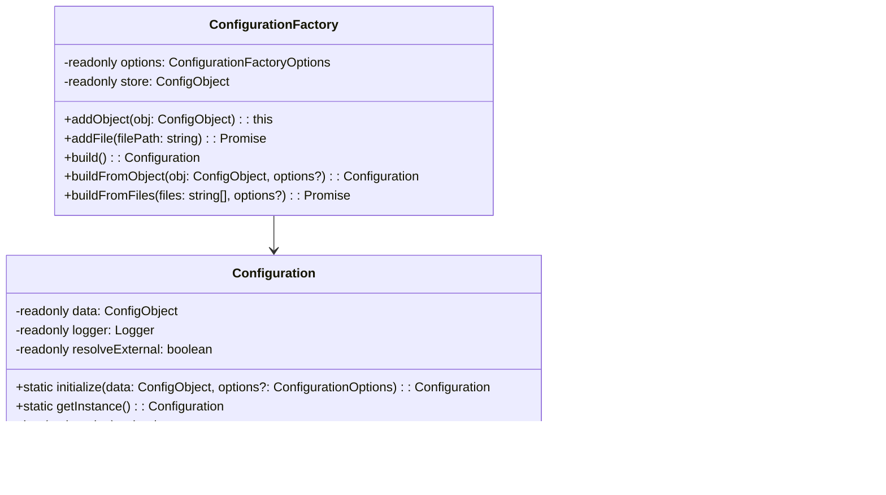

# @fabianopinto/config

Composable, immutable configuration for Node/TypeScript apps with type-safe access, dot-notation paths, and automatic resolution of external references (AWS SSM and S3). ESM-first with CJS compatibility.

- Immutable global configuration via `Configuration`
- Composable `ConfigurationFactory` (merge objects and JSON files)
- Dot-notation `getValue()` with optional auto-resolution of `ssm://` and `s3://` references
- Pluggable provider abstraction: `ConfigurationProvider` and `DefaultConfigurationProvider`
- Structured logging via `@fabianopinto/logger` and robust retries via `@fabianopinto/utils`

This package is part of the ts-common monorepo (see the [root README](../../README.md)) and integrates naturally with:

- [@fabianopinto/errors](../errors/README.md) for structured error handling
- [@fabianopinto/logger](../logger/README.md) for structured logging
- [@fabianopinto/utils](../utils/README.md) for retry, object, and other helpers

## Table of contents

- [Install](#install)
- [Import](#import)
- [API](#api)
- [Usage](#usage)
  - [Initialize and read values](#initialize-and-read-values)
  - [Resolve external references (SSM/S3)](#resolve-external-references-ssms3)
  - [Factory usage (objects and JSON files)](#factory-usage-objects-and-json-files)
  - [Provider usage (DI-friendly)](#provider-usage-di-friendly)
- [Diagrams](#diagrams)
- [Type definitions](#type-definitions)
- [Compatibility](#compatibility)
- [License](#license)

## Install

```bash
pnpm add @fabianopinto/config
# or
npm i @fabianopinto/config
# or
yarn add @fabianopinto/config
```

## Import

```ts
// ESM
import {
  Configuration,
  ConfigurationFactory,
  DefaultConfigurationProvider,
  type ConfigurationProvider,
  type ConfigurationOptions,
  type ConfigObject,
} from "@fabianopinto/config";

// CJS
const {
  Configuration,
  ConfigurationFactory,
  DefaultConfigurationProvider,
} = require("@fabianopinto/config");
```

## API

- [`Configuration`](./src/configuration.ts)
  - `static initialize(data: ConfigObject, options?: ConfigurationOptions): Configuration`
  - `static getInstance(): Configuration`
  - `has(path: string): boolean`
  - `getValue<T = unknown>(path: string): Promise<T | undefined>`
- [`ConfigurationFactory`](./src/factory.ts)
  - `new ConfigurationFactory(options?: ConfigurationFactoryOptions)`
  - `addObject(obj: ConfigObject): this`
  - `addFile(filePath: string): Promise<this>`
  - `build(): Configuration`
  - `static buildFromObject(obj: ConfigObject, options?: ConfigurationFactoryOptions): Configuration`
  - `static buildFromFiles(files: string[], options?: ConfigurationFactoryOptions): Promise<Configuration>`
- [`DefaultConfigurationProvider`](./src/provider.ts)
  - Implements `ConfigurationProvider` by delegating to `Configuration.getInstance()`
- [`resolvers`](./src/resolvers.ts)
  - `resolveSSM(ssmPath: string, logger?: Logger): Promise<string>`
  - `resolveS3(s3Path: string, logger?: Logger): Promise<string>`
  - `isExternalRef(value: unknown): value is string`
- [`types`](./src/types.ts)
  - `ConfigValue`, `ConfigObject`, `ConfigurationOptions`, `ConfigurationProvider`

Note: See `dist/index.d.ts` for the complete, strongly-typed API surface.

## Usage

### Initialize and read values

```ts
import { Configuration } from "@fabianopinto/config";

// Minimal configuration
Configuration.initialize({
  service: {
    name: "users",
    endpoint: "https://api.example.com",
  },
});

// Later in your code
const cfg = Configuration.getInstance();
const endpoint = await cfg.getValue<string>("service.endpoint");
```

- `has(path)` checks existence without resolving external references.
- `getValue(path)` resolves external references by default (can be disabled below).

### Resolve external references (SSM/S3)

```ts
import { Configuration } from "@fabianopinto/config";

Configuration.initialize(
  {
    secrets: {
      dbPassword: "ssm://prod/db/password",
    },
    templates: {
      welcome: "s3://my-bucket/messages/welcome.txt",
    },
  },
  { resolveExternal: true }, // default is true
);

const cfg = Configuration.getInstance();
const password = await cfg.getValue<string>("secrets.dbPassword"); // resolved via SSM
const welcomeMsg = await cfg.getValue<string>("templates.welcome"); // resolved via S3
```

- Resolution uses `RetryUtils.retryAsync` under the hood for resilience.
- Debug logs are emitted when `logger.isLevelEnabled("debug")` is true.

To disable resolution (use raw values), set `resolveExternal: false` when initializing.

### Factory usage (objects and JSON files)

```ts
import { ConfigurationFactory } from "@fabianopinto/config";

// Compose from multiple sources (later sources override earlier ones)
const cfg = await ConfigurationFactory.buildFromFiles(["./config/base.json", "./config/prod.json"]);

// Or programmatically
const cfg2 = ConfigurationFactory.buildFromObject({
  featureFlags: { newDashboard: true },
});
```

- Objects are deep-merged; arrays on the right replace arrays on the left.
- File read/parse errors are wrapped in `ConfigurationError` (`code: "CONFIG_READ_FILE_ERROR"`).

### Provider usage (DI-friendly)

```ts
import { DefaultConfigurationProvider } from "@fabianopinto/config";

const provider = new DefaultConfigurationProvider();
if (provider.has("service.endpoint")) {
  const url = await provider.getValue<string>("service.endpoint");
}
```

## Diagrams

### Class diagram



### Initialization sequence


### Resolution flow


## Advanced examples

### Custom providers

You can implement your own provider to adapt `Configuration` to your DI container, caching strategy, or multi-tenant needs.

```ts
// my-config-provider.ts
import type { ConfigurationProvider } from "@fabianopinto/config";
import { Configuration } from "@fabianopinto/config";

export class MyConfigurationProvider implements ConfigurationProvider {
  constructor(private readonly prefix?: string) {}

  has(path: string): boolean {
    const full = this.prefix ? `${this.prefix}.${path}` : path;
    return Configuration.getInstance().has(full);
  }

  async getValue<T = unknown>(path: string): Promise<T | undefined> {
    const full = this.prefix ? `${this.prefix}.${path}` : path;
    return Configuration.getInstance().getValue<T>(full);
  }
}

// usage
const provider = new MyConfigurationProvider("serviceA");
if (provider.has("endpoint")) {
  const url = await provider.getValue<string>("endpoint");
}
```

### Injecting a custom logger

Provide your own logger (for example, a child of `@fabianopinto/logger`) to control verbosity and context.

```ts
import { Configuration } from "@fabianopinto/config";
import { logger } from "@fabianopinto/logger";

const cfgLogger = logger.child({ module: "config", app: "users" });
cfgLogger.setLevel("debug");

Configuration.initialize(
  { secrets: { token: "ssm://prod/api/token" } },
  { logger: cfgLogger, resolveExternal: true },
);

// When debug is enabled, resolution steps will be logged
await Configuration.getInstance().getValue("secrets.token");
```

### Custom resolvers (extending beyond SSM/S3)

This package resolves `ssm://` and `s3://` references out of the box. To support additional schemes (for example, `vault://`), you can preprocess your configuration and disable built-in resolution, or compose at read-time.

Option A — preprocess then initialize with `resolveExternal: false`:

```ts
import { Configuration } from "@fabianopinto/config";

async function resolveCustomRefs(obj: unknown): Promise<unknown> {
  if (Array.isArray(obj)) return Promise.all(obj.map(resolveCustomRefs));
  if (obj && typeof obj === "object") {
    const out: Record<string, unknown> = {};
    for (const [k, v] of Object.entries(obj)) out[k] = await resolveCustomRefs(v);
    return out;
  }
  if (typeof obj === "string" && obj.startsWith("vault://")) {
    return await fetchFromVault(obj.substring("vault://".length));
  }
  return obj;
}

const raw = {
  secrets: {
    token: "vault://secret/data/api#token",
    dbPass: "ssm://prod/db/password", // leave as-is if you want to keep built-ins
  },
};

const pre = await resolveCustomRefs(raw);
Configuration.initialize(pre as any, { resolveExternal: true /* keep SSM/S3 */ });
```

Option B — wrap calls to `getValue` and intercept your custom schemes first:

```ts
import { Configuration } from "@fabianopinto/config";

async function getConfigValue<T = unknown>(path: string): Promise<T | undefined> {
  const val = await Configuration.getInstance().getValue<T | string>(path);
  if (typeof val === "string" && val.startsWith("vault://")) {
    return (await fetchFromVault(val.substring("vault://".length))) as T;
  }
  return val as T | undefined;
}
```

Both approaches keep the core package focused while allowing you to introduce additional resolution strategies.

## Type definitions

This package ships types at `dist/index.d.ts` and supports TypeScript strict mode.

## Compatibility

- Node 22+
- TypeScript target/lib: ES2024, module: NodeNext
- ESM-first. CJS is available via `require` export.

## License

ISC © Fabiano Pinto
