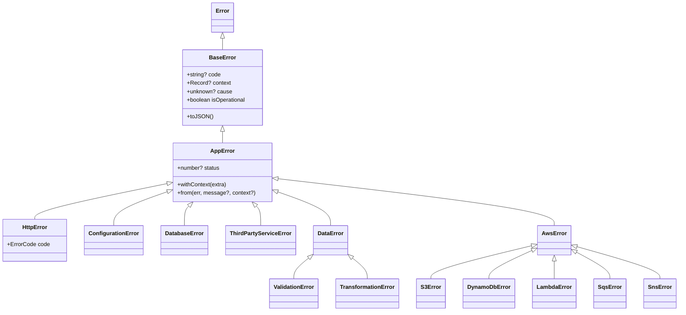
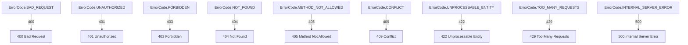

# @fabianopinto/errors

AppError with cause, context and rich specializations for HTTP, data, common infra, and AWS. ESM-first with CJS compatibility.

- Exposes `BaseError` and `AppError` with `cause`, `context`, `code`, `status`, and `isOperational`
- Ready-made classes: `HttpError` (+ `ErrorCode`), `ConfigurationError`, `DatabaseError`, `ThirdPartyServiceError`, `DataError`, `ValidationError`, `TransformationError`, `AwsError`, `S3Error`, `DynamoDbError`, `LambdaError`, `SqsError`, `SnsError`
- Safe JSON serialization of error trees via `toJSON()`
- Ergonomic composition: `AppError.from(err)`, `error.withContext(extra)`

This package is part of the ts-common monorepo (see the [root README](../../README.md)) and integrates with the [@fabianopinto/logger](../logger/README.md) module for structured logging.

## Install

```bash
pnpm add @fabianopinto/errors
# or
npm i @fabianopinto/errors
# or
yarn add @fabianopinto/errors
```

## Import

```ts
// ESM
import { AppError, HttpError, ErrorCode } from "@fabianopinto/errors";

// CJS
const { AppError, HttpError, ErrorCode } = require("@fabianopinto/errors");
```

## Core concepts

- **cause**: chain original failures for debuggability. Any value is accepted; native `Error` and `AppError` are serialized safely.
- **context**: structured diagnostics (e.g., ids, inputs). Merged with `withContext()`.
- **code**: domain-specific identifier (e.g., `USER_NOT_FOUND`).
- **status**: HTTP-like numeric status for transport mapping.
- **isOperational**: true for expected, recoverable errors; false for programmer/config errors.

## API overview

- **BaseError(message, { cause, context, code, isOperational })**
- **AppError(message, { status, cause, context, code, isOperational })**
  - `static from(err, message?, context?)`
  - `withContext(extra)`
  - `toJSON()` returns a safe, serializable error tree
- **HttpError(message, { code: ErrorCode, status?, cause?, context? })**
  - Maps `ErrorCode` -> HTTP status automatically (can override `status`)
  - Factories: `badRequest`, `unauthorized`, `forbidden`, `notFound`, `conflict`, `unprocessableEntity`, `tooManyRequests`, `internalServerError`
- **Common**: `ConfigurationError` (non-operational), `DatabaseError` (operational), `ThirdPartyServiceError` (operational)
- **Data**: `DataError` (operational), `ValidationError`, `TransformationError`
- **AWS**: `AwsError`, `S3Error`, `DynamoDbError`, `LambdaError`, `SqsError`, `SnsError` (operational by default)

## Diagrams

### Class hierarchy



### HTTP code mapping



## Usage

### Create and throw

```ts
import { AppError } from "@fabianopinto/errors";

function loadUser(id: string) {
  if (!id)
    throw new AppError("Missing id", { code: "MISSING_ID", status: 400, isOperational: true });
}
```

### Wrap unknown errors consistently

```ts
import { AppError } from "@fabianopinto/errors";

try {
  await repo.save(input);
} catch (err) {
  throw AppError.from(err, "Failed to save user", { inputId: input.id });
}
```

### Add structured context progressively

```ts
import { AppError } from "@fabianopinto/errors";

try {
  await processPayment();
} catch (err) {
  throw AppError.from(err).withContext({ orderId, userId });
}
```

### HTTP mapping

```ts
import { HttpError, ErrorCode } from "@fabianopinto/errors";

throw new HttpError("User not found", { code: ErrorCode.NOT_FOUND, context: { userId } });
// or
throw HttpError.notFound("User not found", { userId });
```

### Categorize domain failures

```ts
import { ConfigurationError, DatabaseError, ThirdPartyServiceError } from "@fabianopinto/errors";

if (!process.env.DB_URL) throw new ConfigurationError("DB_URL is missing");

try {
  await db.query("...");
} catch (err) {
  throw new DatabaseError("DB query failed", { cause: err, code: "DB_QUERY_FAILED" });
}

try {
  await external.call();
} catch (err) {
  throw new ThirdPartyServiceError("Partner API timeout", { cause: err, code: "PARTNER_TIMEOUT" });
}
```

### Data validation and transformation

```ts
import { ValidationError, TransformationError } from "@fabianopinto/errors";

if (!isEmail(input.email)) {
  throw new ValidationError("Invalid email", { context: { email: input.email } });
}

try {
  const normalized = normalize(input);
} catch (err) {
  throw new TransformationError("Normalization failed", { cause: err });
}
```

### AWS integrations

```ts
import { S3Error, DynamoDbError, LambdaError, SqsError, SnsError } from "@fabianopinto/errors";

try {
  await s3.putObject(params);
} catch (err) {
  throw new S3Error("S3 putObject failed", { cause: err, code: "S3_PUT_ERROR" });
}
```

## Handling and logging

- Catch at boundaries (HTTP handler, message consumer) and map to transport.
- Log errors with the `error` key so the serializer formats them (AppError -> toJSON).

```ts
import { logger } from "@fabianopinto/logger";
import { AppError } from "@fabianopinto/errors";

function handleError(err: unknown) {
  const appErr = AppError.from(err);
  // Serializer recognizes `error` and will call toJSON() for AppError
  logger.error({ error: appErr }, appErr.message);
}

// Optional: child logger and level checks
const httpLogger = logger.child({ component: "http" });
if (httpLogger.isLevelEnabled("debug")) {
  httpLogger.debug({ route: "/users/:id" }, "Handling request");
}
```

## Best practices

- **Prefer AppError.from** at catch sites to normalize unknowns.
- **Use codes** for stable programmatic handling and metrics.
- **Mark operational errors** (transient/expected) with `isOperational: true`.
- **Attach context** early (ids, inputs) and enrich via `withContext()`.
- **Avoid leaking internals** in public messages; put sensitive data in `context`.

## Type definitions

This package ships types at `dist/index.d.ts` and supports TypeScript strict mode.

## Compatibility

- Node 22+
- TypeScript target/lib: ES2024, module: NodeNext, resolution: NodeNext/Bundler
- ESM-first. CJS is available via `require` export.

## License

ISC © Fabiano Pinto
