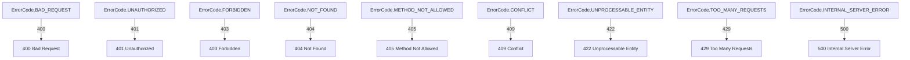

# @fabianopinto/errors

Robust application errors with cause, structured context, consistent codes/status, and focused specializations (HTTP, data, infra, AWS). ESM-first with CJS compatibility.

This package is part of the ts-common monorepo (see the [root README](../../README.md)) and integrates with `@fabianopinto/logger` for structured logging.

## Table of Contents

- [Features](#features)
- [Requirements](#requirements)
- [Install](#install)
- [Recommended patterns](#recommended-patterns)
- [Common scenarios](#common-scenarios)
- [Alternatives & trade-offs](#alternatives--trade-offs)
- [Import](#import)
- [Core concepts](#core-concepts)
- [API overview](#api-overview)
- [Diagrams](#diagrams)
  - [Class hierarchy](#class-hierarchy)
  - [HTTP code mapping](#http-code-mapping)
- [Handling and logging](#handling-and-logging)
- [Type definitions](#type-definitions)
- [Compatibility](#compatibility)
- [License](#license)

## Features

- Exposes `BaseError` and `AppError` with `cause`, `context`, `code`, `status`, and `isOperational`.
- Specializations: `HttpError` (+ `ErrorCode`), `ConfigurationError`, `DatabaseError`, `ThirdPartyServiceError`, `DataError`, `ValidationError`, `TransformationError`, `AwsError`, `S3Error`, `DynamoDbError`, `LambdaError`, `SqsError`, `SnsError`.
- Safe JSON serialization of error trees via `toJSON()` (works well with `@fabianopinto/logger`).
- Ergonomic composition: `AppError.from(err)`, `error.withContext(extra)`.

## Requirements

- Node 22+
- TypeScript strict mode recommended (package ships `.d.ts`)

## Install

```bash
pnpm add @fabianopinto/errors
# or
npm i @fabianopinto/errors
# or
yarn add @fabianopinto/errors
```

## Recommended patterns

Use these patterns to keep error handling consistent, minimal, and expressive.

### Principles

- **Prefer AppError.from** at catch sites to normalize unknowns.
- **Use codes** for stable programmatic handling and metrics.
- **Mark operational errors** (transient/expected) with `isOperational: true`.
- **Attach context** early (ids, inputs) and enrich via `withContext()`.
- **Avoid leaking internals** in public messages; put sensitive data in `context`.

1. Normalize unknowns at boundaries

```ts
import { AppError } from "@fabianopinto/errors";

export async function handler() {
  try {
    await service.doWork();
  } catch (err) {
    // Always normalize here
    throw AppError.from(err, "Failed to process request", { component: "handler" });
  }
}
```

2. Prefer HTTP factories and from-unknown helpers

```ts
import { HttpError } from "@fabianopinto/errors";

// Simple factories
throw HttpError.notFound("User not found", { userId });
throw HttpError.conflict("Username already taken");

// Convert unknown -> HttpError with mapped status
try {
  await db.save(user);
} catch (err) {
  throw HttpError.fromConflict(err, "User save conflict", { userId });
}
```

3. Use guards instead of manual if/throw

```ts
import { ConfigurationError, ValidationError, HttpError } from "@fabianopinto/errors";

// Configuration
const dbUrl = ConfigurationError.require(process.env.DB_URL, "DB_URL is required");
ConfigurationError.ensure(isValidConfig(cfg), "Invalid configuration", { context: { cfg } });

// Domain validation
ValidationError.ensure(isEmail(input.email), "Invalid email", { context: { email: input.email } });
const id = ValidationError.require(input.id, "Missing id");

// HTTP boundary
HttpError.ensure(userId, "Missing userId", { route: "/users/:id" });
```

4. Enrich context progressively

```ts
try {
  await processPayment();
} catch (err) {
  throw AppError.from(err, "Payment processing failed").withContext({ orderId, userId });
}
```

5. Prefer service-specific helpers for AWS/DB/3P

```ts
import { S3Error, DynamoDbError, ThirdPartyServiceError } from "@fabianopinto/errors";

// AWS S3
throw S3Error.objectNotFound("Avatar not found", { context: { bucket, key } });

// DynamoDB
throw DynamoDbError.conditionalCheckFailed("Optimistic concurrency failed", {
  context: { pk, sk },
});

// Third-party
throw ThirdPartyServiceError.timeout("Partner API timed out", { context: { partner: "acme" } });
```

## Common scenarios

- Map domain -> HTTP response in an API handler

```ts
import { AppError, HttpError } from "@fabianopinto/errors";

export function toHttp(err: unknown) {
  const e = AppError.from(err);
  if (HttpError.is(e)) return { status: e.status ?? 500, body: { error: e.toJSON() } };
  // Default: internal error
  return { status: 500, body: { error: HttpError.internalServerError(e.message, e).toJSON() } };
}
```

- Wrap and tag context at layers (repo -> service -> handler)

```ts
try {
  await repo.save(user);
} catch (err) {
  throw AppError.from(err, "Failed to save user").withContext({
    component: "user-service",
    userId,
  });
}
```

- Validate request, return 422 vs 400

```ts
import { HttpError } from "@fabianopinto/errors";

if (!isValid(input)) throw HttpError.unprocessableEntity("Invalid payload", { field: "name" });
```

## Alternatives & trade-offs

- Constructors vs factories
  - Prefer factories (`HttpError.notFound`, `S3Error.objectNotFound`, `DatabaseError.queryFailed`) to avoid repeating `code/status` mappings and to keep intent clear.
  - Use constructors when no factory exists or when you must fully control `status`, `code`, or `isOperational`.

- Generic vs specialized wrappers
  - `AppError.from` is ideal at catch sites to normalize unknowns.
  - Use specialized `from(...)` (e.g., `S3Error.from`, `DynamoDbError.from`) when the domain is known and you want domain defaults.

- Codes provide stable programmatic hooks and metrics; statuses are transport-facing. Prefer setting both in boundaries (HTTP, queues) but keep sensitive detail in `context`.

- Guard helpers vs inline checks
  - `ensure/require` are more declarative and yield consistent 400 semantics for HTTP or Validation errors.

- Operational vs non-operational
  - Mark expected/transient issues as `isOperational: true` to support graceful handling; configuration/programmer errors should remain non-operational.

## Import

```ts
// ESM
import { AppError, HttpError, ErrorCode } from "@fabianopinto/errors";

// CJS
const { AppError, HttpError, ErrorCode } = require("@fabianopinto/errors");
```

## Core concepts

- **cause**: chain original failures for debuggability. Any value is accepted; native `Error` and `AppError` are serialized safely.
- **context**: structured diagnostics (e.g., ids, inputs). Merged with `withContext()`.
- **code**: domain-specific identifier (e.g., `USER_NOT_FOUND`).
- **status**: HTTP-like numeric status for transport mapping.
- **isOperational**: true for expected, recoverable errors; false for programmer/config errors.

## API overview

- **BaseError(message, { cause, context, code, isOperational })**
- **AppError(message, { status, cause, context, code, isOperational })**
  - `static from(err, message?, context?)`
  - `withContext(extra)`
  - `toJSON()` returns a safe, serializable error tree
- **HttpError(message, { code: ErrorCode, status?, cause?, context? })**
  - Maps `ErrorCode` -> HTTP status automatically (can override `status`)
  - Factories: `badRequest`, `unauthorized`, `forbidden`, `notFound`, `conflict`, `unprocessableEntity`, `tooManyRequests`, `internalServerError`
- **Common**: `ConfigurationError` (non-operational), `DatabaseError` (operational), `ThirdPartyServiceError` (operational)
- **Data**: `DataError` (operational), `ValidationError`, `TransformationError`
- **AWS**: `AwsError`, `S3Error`, `DynamoDbError`, `LambdaError`, `SqsError`, `SnsError` (operational by default)

## Diagrams

### Class hierarchy


### HTTP code mapping



## Handling and logging

- Catch at boundaries (HTTP handler, message consumer) and map to transport.
- Log errors with the `error` key so the serializer formats them (AppError -> toJSON).

```ts
import { logger } from "@fabianopinto/logger";
import { AppError } from "@fabianopinto/errors";

function handleError(err: unknown) {
  const appErr = AppError.from(err);
  // Serializer recognizes `error` and will call toJSON() for AppError
  logger.error({ error: appErr }, appErr.message);
}

// Optional: child logger and level checks
const httpLogger = logger.child({ component: "http" });
if (httpLogger.isLevelEnabled("debug")) {
  httpLogger.debug({ route: "/users/:id" }, "Handling request");
}
```

## Type definitions

This package ships types at `dist/index.d.ts` and supports TypeScript strict mode.

## Compatibility

- Node 22+
- TypeScript target/lib: ES2024, module: NodeNext, resolution: NodeNext/Bundler
- ESM-first. CJS is available via `require` export.

## License

ISC © Fabiano Pinto
