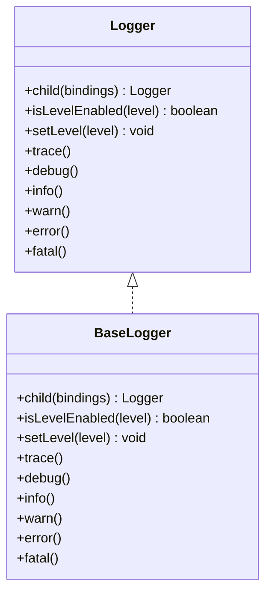
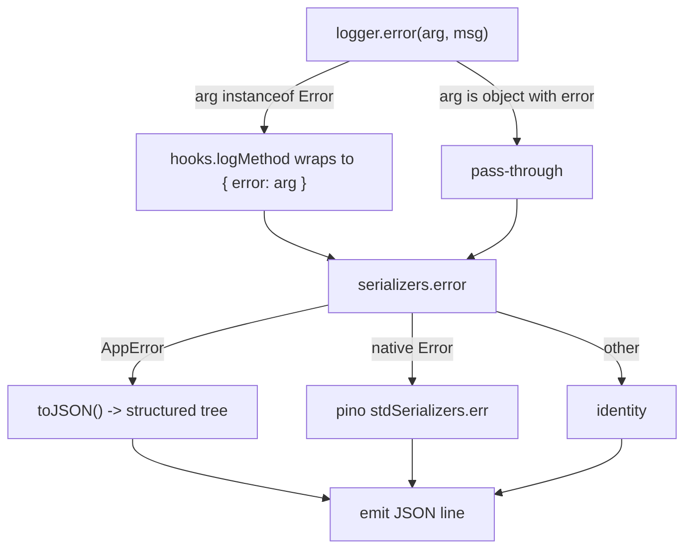

# @fabianopinto/logger

Pino-based logger with a clean interface and first-class error serialization.

- Simple API: `trace`, `debug`, `info`, `warn`, `error`, `fatal`
- Contextual logging with `child()`
- Dynamic level control: `isLevelEnabled()`, `setLevel()`
- Error-aware: pass `Error`/`AppError` directly or via `{ error }`, serialized safely
- ESM-first with CJS compatibility

This package is part of the ts-common monorepo (see the [root README](../../README.md)) and integrates with the [@fabianopinto/errors](../errors/README.md) module for structured error serialization.

## Install

```bash
pnpm add @fabianopinto/logger
# or
npm i @fabianopinto/logger
# or
yarn add @fabianopinto/logger
```

## Import

```ts
// ESM
import { logger, BaseLogger, type Level } from "@fabianopinto/logger";

// CJS
const { logger, BaseLogger } = require("@fabianopinto/logger");
// Level is a type-only import in ESM; for CJS, use JSDoc typedefs if needed
```

## API overview

- `BaseLogger(options?)`
  - `trace | debug | info | warn | error | fatal: LogFn`
  - `child(bindings: Record<string, unknown>): Logger`
  - `isLevelEnabled(level: Level): boolean`
  - `setLevel(level: Level): void`
- `logger`: a default `BaseLogger` instance

### Options

- `level?: Level` — minimum level (default: normalized from `LOG_LEVEL` or `info`)
- `name?: string` — logger name (included in output)
- `pretty?: boolean` — pretty print in non-production; falls back to JSON if `pino-pretty` is unavailable
- `base?: Record<string, unknown>` — base fields (default includes `pid`)

## Usage

### Basic logging

```ts
import { logger } from "@fabianopinto/logger";

logger.info("Service started");
logger.debug({ feature: "auth" }, "Feature enabled");
```

### Child logger with context

```ts
const httpLogger = logger.child({ component: "http" });
httpLogger.info({ route: "/users/:id" }, "Handling request");
```

### Efficient conditional logging

```ts
if (logger.isLevelEnabled("debug")) {
  const expensive = computeDiagnostics();
  logger.debug({ diagnostics: expensive }, "Debug details");
}
```

### Dynamic log level

```ts
logger.setLevel("warn"); // suppress info/debug
logger.warn("Threshold approaching");
```

### Error serialization (with @fabianopinto/errors)

```ts
import { AppError } from "@fabianopinto/errors";

try {
  throw new AppError("Invalid input", { code: "BAD_INPUT", status: 400, context: { id: 1 } });
} catch (err) {
  // Preferred: pass Error/AppError as the first argument
  logger.error(err as Error, "Failed to process request");

  // Alternatively: pass as an object with an `error` property
  logger.error({ error: err, requestId: "abc" }, "Failed to process request");
}
```

Notes:

- If you pass an `Error`/`AppError` as the first argument, the logger auto-wraps it as `{ error }` so the serializer runs.
- When the object already contains `error`, it is passed through.
- Passing an `Error` as the second positional argument is not auto-wrapped.

## Diagrams

### Class & interface overview



### Error serialization flow



## Compatibility

- Node 18+
- TypeScript target/lib: ES2024, module: NodeNext, resolution: NodeNext/Bundler
- ESM-first. CJS is available via `require` export.

## License

ISC © Fabiano Pinto
