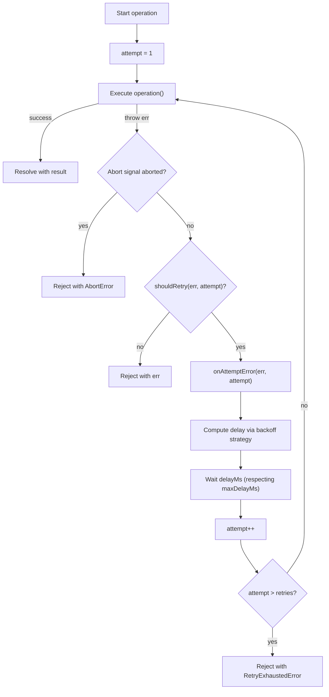

# @fabianopinto/utils

A collection of focused, well-tested utilities for everyday Node/TypeScript development. ESM-first with CJS compatibility.

- Date/time helpers
- Environment parsing and validation
- Numbers and math helpers
- Obfuscation and redaction helpers
- Object manipulation and guards
- Random values and UUIDs
- Robust async retry with backoff strategies
- String utilities
- URL and querystring helpers

This package is part of the ts-common monorepo (see the [root README](../../README.md)) and integrates naturally with:

- [@fabianopinto/errors](../errors/README.md) for structured error handling
- [@fabianopinto/logger](../logger/README.md) for structured logging

## Table of contents

- [Install](#install)
- [Import](#import)
- [API](#api)
- [Usage](#usage)
  - [Environment parsing](#environment-parsing)
  - [Retry with backoff and abort signal](#retry-with-backoff-and-abort-signal)
  - [Obfuscation and redaction](#obfuscation-and-redaction)
  - [URL helpers](#url-helpers)
  - [Object helpers](#object-helpers)
- [Retry + Errors + Logger integration](#retry--errors--logger-integration)
- [Type definitions](#type-definitions)
- [Compatibility](#compatibility)
- [License](#license)

## Install

```bash
pnpm add @fabianopinto/utils
# or
npm i @fabianopinto/utils
# or
yarn add @fabianopinto/utils
```

## Import

```ts
// ESM
import {
  DateUtils,
  EnvUtils,
  NumberUtils,
  ObfuscationUtils,
  ObjectUtils,
  RandomUtils,
  RetryUtils,
  StringUtils,
  UrlUtils,
} from "@fabianopinto/utils";

// CJS
const {
  DateUtils,
  EnvUtils,
  NumberUtils,
  ObfuscationUtils,
  ObjectUtils,
  RandomUtils,
  RetryUtils,
  StringUtils,
  UrlUtils,
} = require("@fabianopinto/utils");
```

## API

- [`DateUtils`](./src/date.ts)
  - `formatISO(date?: Date): string`
  - `getCurrentTimestamp(): string`
  - `toUnix(date?: Date): number`
  - `fromUnix(seconds: number): Date`
  - `isSameDay(a: Date, b: Date): boolean`
  - `addDays(date: Date, days: number): Date`
  - `isExpired(date: Date, reference?: Date): boolean`
  - `parseDuration(input: string): number`
  - `wait(duration: number | string): Promise<void>`

- [`EnvUtils`](./src/env.ts)
  - `getEnv(name: string, defaultValue?: string): string | undefined`
  - `requireEnv(name: string): string`
  - `getBoolEnv(name: string, defaultValue = false): boolean`
  - `getNumberEnv(name: string, defaultValue = 0): number`
  - `getJsonEnv<T = unknown>(name: string, defaultValue?: T): T | undefined`

- [`NumberUtils`](./src/number.ts)
  - `clamp(value: number, min: number, max: number): number`
  - `inRange(value: number, min: number, max: number): boolean`
  - `safeParseInt(input: unknown, defaultValue = 0, radix = 10): number`
  - `safeParseFloat(input: unknown, defaultValue = 0): number`

- [`ObfuscationUtils`](./src/obfuscation.ts)
  - `mask(value: string, maskChar = "*"): string`
  - `partialMask(value: string, opts?: PartialMaskOptions): string`
  - `obfuscateHeaders(headers: Record<string, string>, opts?: PartialMaskOptions): Record<string, string>`
  - `obfuscateObject<T>(input: T, options?: ObfuscateObjectOptions): T`
  - `redactString(input: string, patterns: Array<string | RegExp>, replacement = "[REDACTED]"): string`
  - Types: `PartialMaskOptions`, `ObfuscateObjectOptions`

- [`ObjectUtils`](./src/object.ts)
  - `deepGet<T = unknown>(obj: unknown, path: string): T | undefined`
  - `deepSet<T extends Record<string, unknown>>(obj: T, path: string, value: unknown): T`
  - `deepMerge<T extends Record<string, unknown>, U extends Record<string, unknown>>(target: T, source: U): T & U`
  - `pick<T extends object, K extends keyof T>(obj: T, keys: K[]): Pick<T, K>`
  - `omit<T extends object, K extends keyof T>(obj: T, keys: K[]): Omit<T, K>`
  - `compact<T extends Record<string, unknown>>(obj: T): Partial<T>`
  - `shallowEqual(a: Record<string, unknown>, b: unknown): boolean`
  - `ensureArray<T>(value: T | T[] | null | undefined): T[]`
  - `deepFreeze<T extends object>(obj: T): Readonly<T>`

- [`RandomUtils`](./src/random.ts)
  - `uuid(): string`
  - `randomInt(min: number, max: number): number`
  - `randomString(length: number, charset?: string): string`
  - `pickOne<T>(arr: T[]): T`
  - `shuffle<T>(arr: T[]): T[]`

- [`RetryUtils`](./src/retry.ts)
  - `retryAsync<T>(operation: () => Promise<T>, options?: RetryOptions): Promise<T>`
  - Types: `BackoffStrategy`, `RetryOptions`, `RetryExhaustedError`

- [`StringUtils`](./src/string.ts)
  - `isEmpty(value: string | null | undefined): boolean`
  - `toTitleCase(value: string): string`
  - `normalizeWhitespace(value: string): string`
  - `capitalize(value: string): string`
  - `toCamelCase(value: string): string`
  - `toKebabCase(value: string): string`
  - `toSnakeCase(value: string): string`
  - `truncate(value: string, maxLength: number, ellipsis = "…"): string`
  - `tryParseJson<T = unknown>(value: string): T | undefined`
  - `slugify(value: string): string`
  - `stripAnsi(value: string): string`

- [`UrlUtils`](./src/url.ts)
  - `join(base: string, path: string): string`
  - `withQuery(url: string, params: Record<string, string | number | boolean | undefined>): string`
  - `toQueryString(params: Record<string, string | number | boolean | undefined>): string`
  - `parseQueryString(input: string): Record<string, string | string[]>`

Note: See `dist/index.d.ts` for the complete, strongly-typed API surface.

## Usage

### Environment parsing

```ts
import { EnvUtils } from "@fabianopinto/utils";

const PORT = EnvUtils.getNumberEnv("PORT", 3000);
const DEBUG = EnvUtils.getBoolEnv("DEBUG", false);
const API_KEY = EnvUtils.requireEnv("API_KEY");
```

### Retry with backoff and abort signal

```ts
import { RetryUtils } from "@fabianopinto/utils";

const controller = new AbortController();

async function fetchWithTransientFailures() {
  // Simulate work that may fail transiently
  return "ok";
}

const result = await RetryUtils.retryAsync(fetchWithTransientFailures, {
  retries: 3,
  delayMs: 200,
  backoff: "exponential-jitter",
  signal: controller.signal,
  shouldRetry: async (err, attempt) => attempt < 3, // custom predicate
});
```

#### Flow



## Retry + Errors + Logger integration

`RetryUtils` is designed to work seamlessly with `@fabianopinto/errors` and `@fabianopinto/logger` for end-to-end observability.

```ts
import { RetryUtils } from "@fabianopinto/utils";
import { AppError } from "@fabianopinto/errors";
import { logger } from "@fabianopinto/logger";

async function getUser(id: string) {
  try {
    // your I/O
  } catch (err) {
    throw AppError.from(err, "Failed to fetch user", { id });
  }
}

const result = await RetryUtils.retryAsync(() => getUser("42"), {
  retries: 3,
  delayMs: 250,
  backoff: "exponential-jitter",
  onAttemptError: (err, attempt) => {
    // Logged as warn by default; you can add your own context
    logger.warn({ attempt, error: AppError.from(err) }, "retrying getUser");
  },
  shouldRetry: (err) => AppError.from(err).isOperational === true,
});

logger.info({ result }, "user loaded");
```

### Obfuscation and redaction

```ts
import { ObfuscationUtils } from "@fabianopinto/utils";

// Obfuscate auth header while preserving scheme
const headers = ObfuscationUtils.obfuscateHeaders({ Authorization: "Bearer abcdef123456" });
// => { Authorization: "Bearer ********3456" }
```

### URL helpers

```ts
import { UrlUtils } from "@fabianopinto/utils";

const full = UrlUtils.join("https://api.example.com", "v1/users");
const withQuery = UrlUtils.withQuery(full, { limit: 10, q: "john" });
```

### Object helpers

```ts
import { ObjectUtils } from "@fabianopinto/utils";

const input = { id: 1, name: "Jane", password: "secret" };
const safe = ObjectUtils.omit(input, ["password"]);
// => { id: 1, name: "Jane" }

// Deep merge with pruning (objects recursively merged; arrays replaced; null prunes keys)
const a = { a: { x: 1, y: 2, arr: [1, 2] }, b: 1 };
const b = { a: { y: null, arr: [9] }, c: 3 };
const merged = ObjectUtils.deepMerge(a, b);
// => { a: { x: 1, arr: [9] }, b: 1, c: 3 }

// Deep get (dot-notation path)
const obj = { a: { b: { c: 123 } }, mixed: { arr: [{ x: 1 }, { y: 2 }] } };
ObjectUtils.deepGet<number>(obj, "a.b.c"); // => 123
ObjectUtils.deepGet(obj, "mixed.arr.1.y"); // => 2
```

## Error handling and logging

These utilities pair well with structured errors and logging:

```ts
import { AppError } from "@fabianopinto/errors";
import { logger } from "@fabianopinto/logger";

try {
  // ... your code
} catch (err) {
  const appErr = AppError.from(err, "Operation failed");
  logger.error({ error: appErr }, appErr.message);
}
```

## Type definitions

This package ships types at `dist/index.d.ts` and supports TypeScript strict mode.

## Compatibility

- Node 22+
- TypeScript target/lib: ES2024, module: NodeNext
- ESM-first. CJS is available via `require` export.

## License

ISC © Fabiano Pinto
